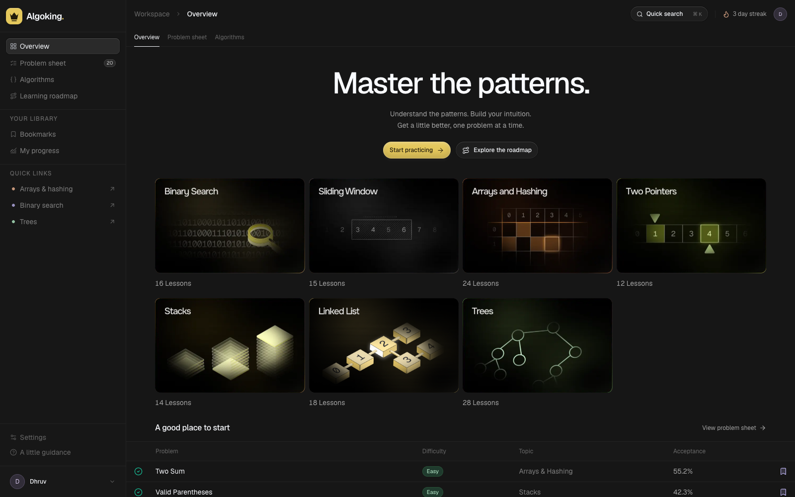

<div align="center">

# Algoking

**A little practice. A lot of progress.**

A minimal workspace for learning data structures and algorithms, recognizing patterns, and building a consistent practice habit.


[Features](#features) · [Getting started](#getting-started) · [Project structure](#project-structure) · [Contributing](#contributing)

</div>

## Landing page



The overview brings learning patterns, a visual roadmap, and practice problems into one focused dashboard, with responsive navigation and locally bundled Geist typography.

## Features

- **Pattern-based learning** — explore Arrays & Hashing, Two Pointers, Stacks, Binary Search, Sliding Window, Linked Lists, and Trees.
- **Searchable problem sheet** — browse 20 sample problems, search by title or topic, and filter by difficulty.
- **Problem details** — review sample challenges, examples, and starting hints; use your preferred editor to write and run solutions.
- **Algorithm reference** — read concise pattern explanations and time-complexity notes.
- **Visual learning roadmap** — follow connected topics and choose what to practice next.
- **Bookmarks and progress** — save problems, mark them solved, and revisit progress derived from the sample problem set.
- **Quick search** — open the search dialog with `⌘ K` on macOS or `Ctrl K` on Windows/Linux.

### Preview scope

Algoking is currently a frontend preview backed by sample data in [`lib/data.ts`](lib/data.ts). Problem acceptance rates, lesson totals, topic counts, and streak indicators are illustrative. Some problem details contain placeholder content.

Bookmarks and solved overrides persist in the current browser's local storage. There is no backend, authentication, cross-device synchronization, or built-in code execution. Settings are session-only preview controls.

## Getting started

### Requirements

- Node.js **20.9 or later**
- npm

### Run locally

```bash
git clone https://github.com/dhruv-colosus/algoking.git
cd algoking
npm ci
npm run dev
```

Open [http://localhost:3000](http://localhost:3000). The current preview requires no environment variables, API keys, or database setup.

### Production build

```bash
npm run build
npm run start
```

The build script explicitly uses Webpack. Fonts are bundled in `public/fonts`, so the build does not need to download them.

## Development commands

| Command | Purpose |
| --- | --- |
| `npm run dev` | Start the Next.js development server. |
| `npm run build` | Create a production build with Webpack. |
| `npm run start` | Serve the completed production build. |
| `npm run lint` | Run ESLint across the project. |
| `npm run typecheck` | Check TypeScript without emitting files. |

## Routes

| Route | View |
| --- | --- |
| `/` | Landing page and featured practice problems |
| `/problems` | Searchable problem sheet with difficulty filters |
| `/problems/[slug]` | Problem details, hints, and practice actions |
| `/algorithms` | Algorithm and pattern overview |
| `/algorithms/[slug]` | Pattern details and related problems |
| `/topics/[slug]` | Alternate entry point for pattern details |
| `/roadmap` | Visual learning roadmap |
| `/bookmarks` | Saved problems |
| `/progress` | Progress overview based on sample problems and local solved state |
| `/settings` | Preview practice preferences |

## Project structure

```text
app/                       App Router pages, shared layout, and styles
components/
  home/                    Illustrated topic cards
  layout/                  Shared navigation and application shell
  problems/                Problem lists, actions, and local state
  ui/                      Reusable UI primitives
lib/                       Sample study data and shared utilities
public/                    Fonts, topic illustrations, and roadmap assets
docs/                      Design documentation and preview images
skills/algoking-design/    Project-local design guidance
```

The stack combines Next.js App Router, React, TypeScript, and Tailwind CSS, with Lucide icons and shared component variants. Shell and home styles live in `app/globals.css`; secondary study-page layouts live in `app/secondary.css`.

## Design documentation

The visual system adapts the compact dark dashboard styling and selected UI primitives from [kargulstudio/sales-crm](https://github.com/kargulstudio/sales-crm) for a DSA study product.

- [Design tokens and layout guidance](docs/design-system.md)
- [Shared component contracts](docs/components.md)
- [Reference and adaptation record](docs/reference.md)
- [Project-local design skill](skills/algoking-design/SKILL.md)

## Contributing

Read [`AGENTS.md`](AGENTS.md) before making changes. For frontend work, follow the local design skill and linked component documentation to preserve the shared shell and existing styling. When using an AI coding agent, consult the installed Next.js guides in `node_modules/next/dist/docs/` for version-specific conventions.

Before submitting compiled code changes, run:

```bash
npm run build
npm run lint
npm run typecheck
```

Check meaningful UI changes at desktop and mobile widths, including keyboard navigation and visible focus states. Include a concise explanation of the change and relevant screenshots in your pull request.

## Tags

`dsa` · `data-structures` · `algorithms` · `coding-practice` · `interview-preparation` · `learning-platform` · `nextjs` · `react` · `typescript` · `tailwindcss`
